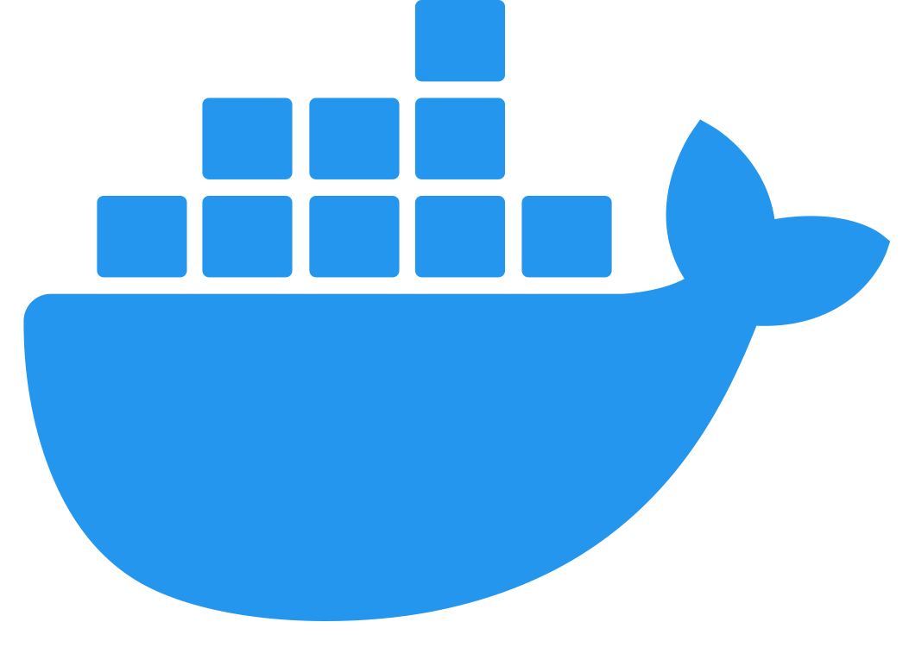
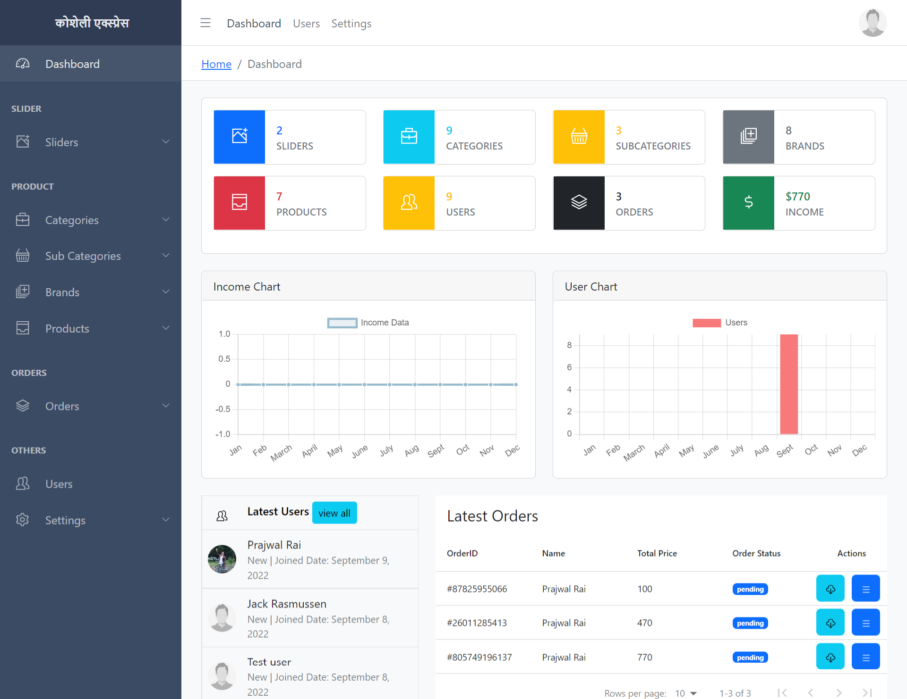
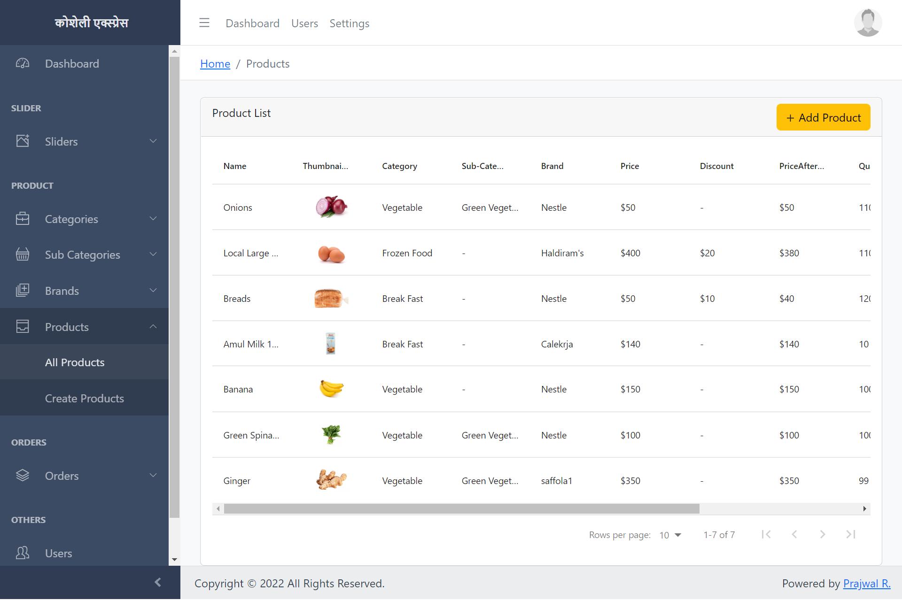
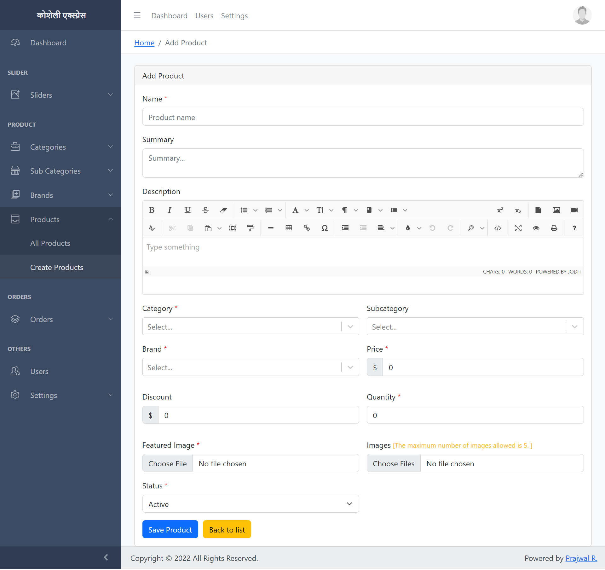
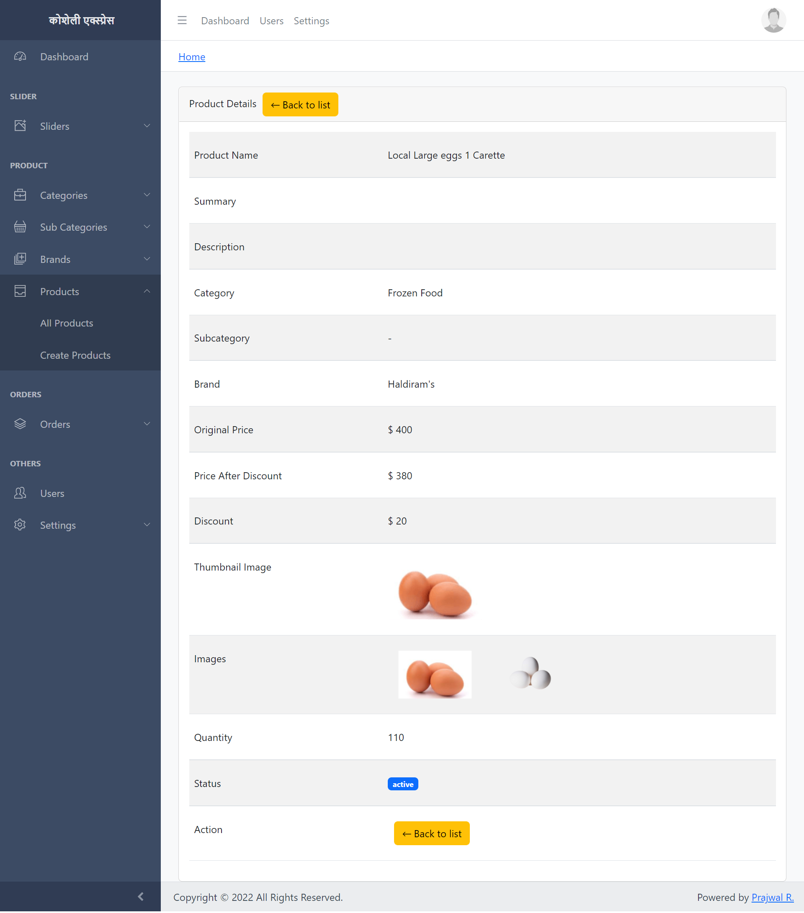

<p align="center">          </p>


# (कोशेली एक्स्प्रेस) Ecommerce MERN 
 A Dockerize Full-Stack ecommerce application that uses latest technologies React, Redux, MongoDB, Nodejs, ExpressJS, Typescript and JWT Authentication that allows user to upload and manage ecommerce data.
 


<hr>

  [](https://github.com/Prajwal100)
  [](https://choosealicense.com/licenses/mit/)
  [](https://github.com/Prajwal100/KOSHELI-MERN)
  [](https://github.com/Prajwal100/KOSHELI-MERN)
  
  ### Demo video:- https://youtu.be/b_xbF_XGIDI

  ## Table of Content
  * [ Project Links ](#Project-Links)
  * [ Technologies ](#Technologies)
  * [ Installation ](#Installation)
  * [ Screenshots-Demo ](#Screenshots-Demo)
  * [ Author Contact ](#Author-Contact)
  * [ License ](#License)
  #

  ##  Project Links
  
  ##### GitHub Repo link: https://github.com/Prajwal100/kosheli-backend

  ## Technologies 
  
-  [Node](https://nodejs.org/en/)

- [Typescript](https://www.typescriptlang.org/)

- [Express](https://expressjs.com/)

- [Mongoose](https://mongoosejs.com/)

- [React](https://reactjs.org/)

- [Redux](https://redux.js.org/)

- [Docker](https://www.docker.com/)
<br>
  
  ## Installation
 

#### Install Dependencies

```
cd KOSHELI-MERN
docker compose up
```
### For live code changes
```
docker compose watch
```
  ## Screenshots-Demo
  <kbd></kbd><br>
  
  <kbd></kbd><br>
  
 <kbd></kbd><br>
 
 <kbd></kbd><br>

  
  ## Author Contact
  Contact me with any questions!<br>

  Email: Prajwal.iar@gmail.com

  ## License
  This project is [MIT](https://choosealicense.com/licenses/mit/) licensed.<br />
<hr>
  Copyright © 2023 [Prajwal R.](https://raiprajwal.com/)

