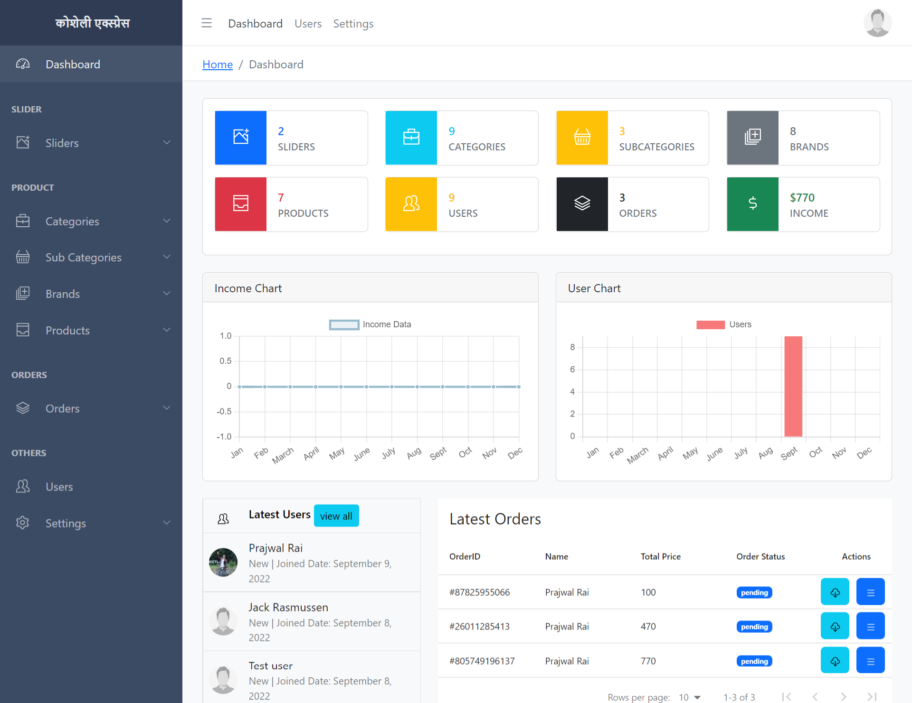
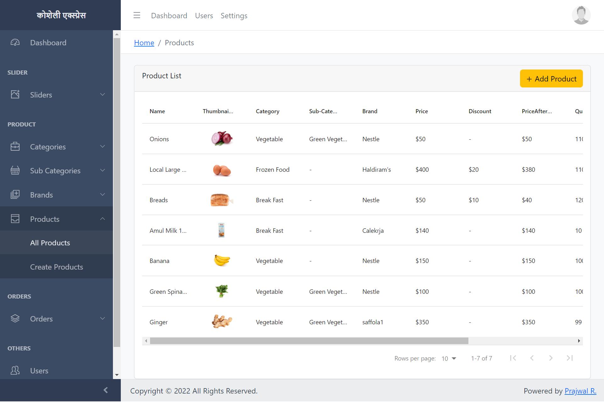
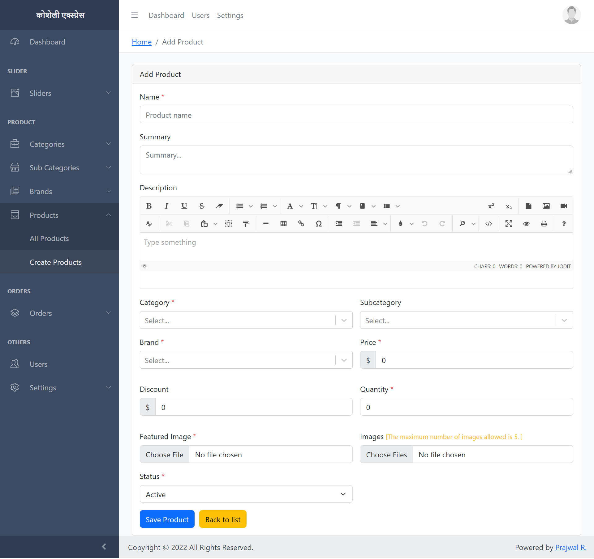
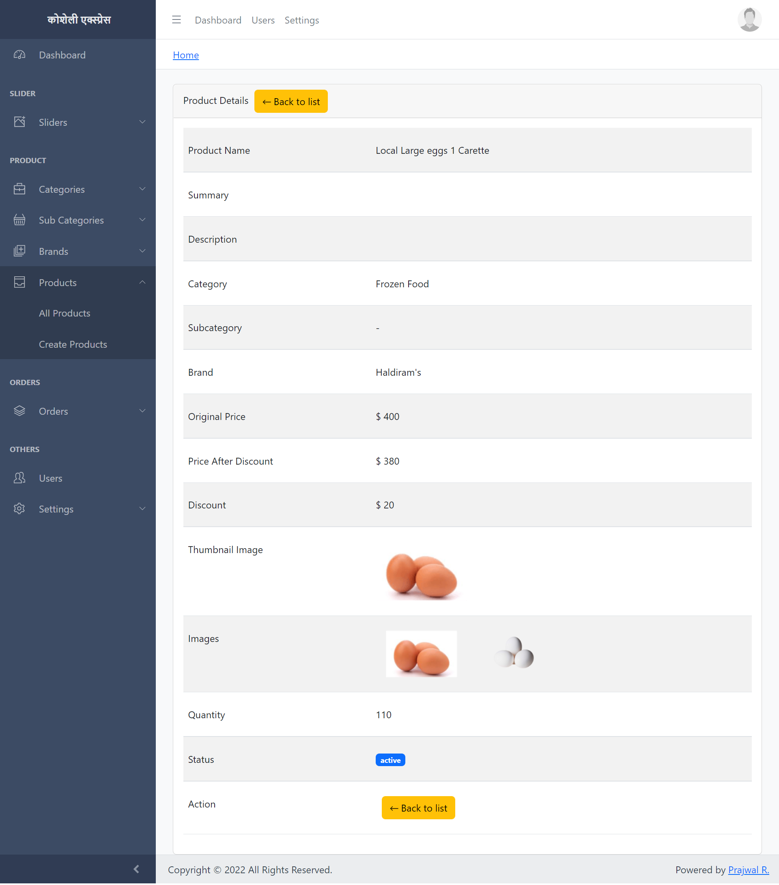

# (कोशेली एक्स्प्रेस) Ecommerce Backend
 A Full-Stack ecommerce application that uses latest technologies React, Redux, MongoDB, Nodejs, ExpressJS, Typescript and JWT Authentication that allows user to upload and manage ecommerce data.
 


<hr>

  [](https://github.com/Prajwal100)
  [](https://choosealicense.com/licenses/mit/)
  
  ### demo video:- https://youtu.be/b_xbF_XGIDI
  
  #### API REPO:- https://github.com/Prajwal100/kosheli-api
  #### FRONTEND REPO:- https://github.com/Prajwal100/kosheli-frontend


  ## Table of Content
  * [ Project Links ](#Project-Links)
  * [ Screenshots-Demo ](#Screenshots-Demo)
  * [ Technologies ](#Technologies)
  * [ Installation ](#Installation)
  * [ Author Contact ](#Author-Contact)
  * [ License ](#License)
  #

  ##  Project Links
  
  ##### GitHub Repo link: https://github.com/Prajwal100/kosheli-backend

  ## Screenshots-Demo
  <kbd></kbd><br>
  
  <kbd></kbd><br>
  
 <kbd></kbd><br>
 
 <kbd></kbd><br>
  ## Technologies 
  
- [Node](https://nodejs.org/en/)

- [Typescript](https://www.typescriptlang.org/)

- [Express](https://expressjs.com/)

- [Mongoose](https://mongoosejs.com/)

- [React](https://reactjs.org/)

- [Redux](https://redux.js.org/)
<br>
  
  ## Installation
 #### Env Variables

rename .env.copy to .env

#### Install Dependencies

```
cd kosheli-backend
npm i
```

```
npm run start
```
  
  ## Author Contact
  Contact me with any questions!<br>

  Email: Prajwal.iar@gmail.com

  ## License
  This project is [MIT](https://choosealicense.com/licenses/mit/) licensed.<br />
<hr>
  Copyright © 2023 [Prajwal R.](https://raiprajwal.com/)

